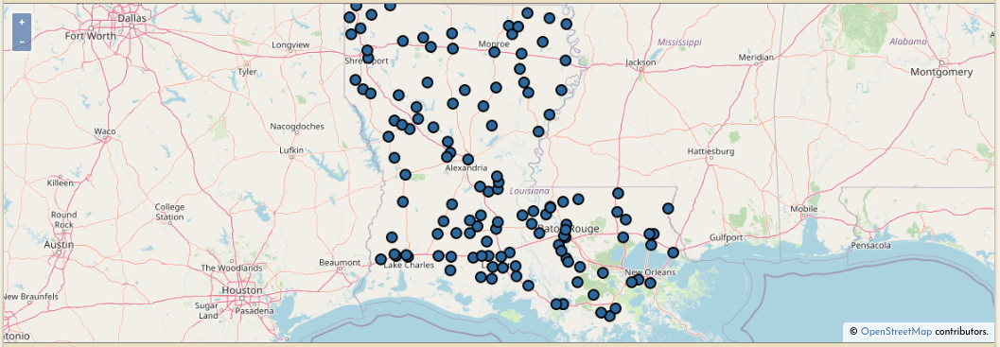
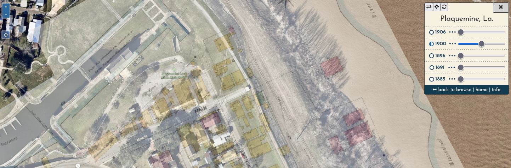
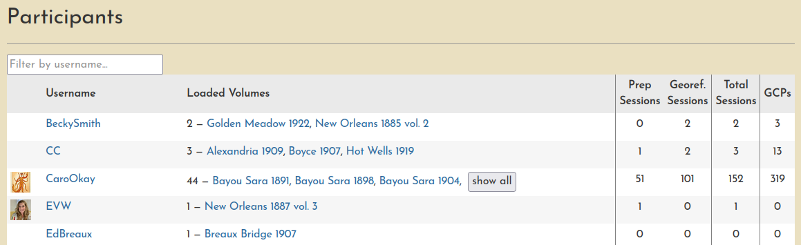
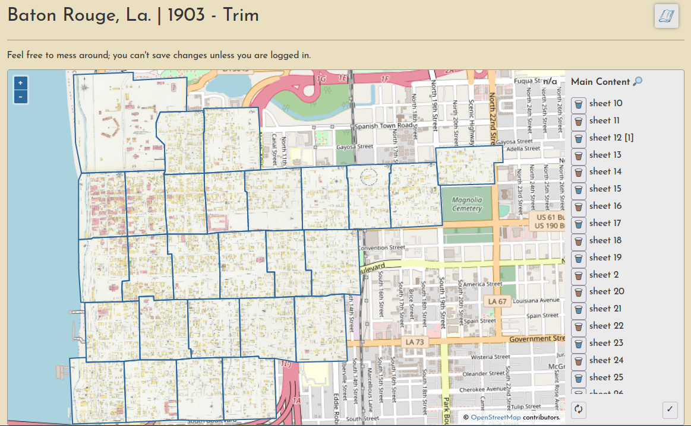

import Screenshot from './Screenshot_20230106-184641-sm.png';

Near the end of the pilot project the platform was starting to bog down, but I still had to use the tools myself to prepare the content for transfer to [LSU Atlas](http://atlas.ga.lsu.edu) (which has been the plan all along). So, I decided to [take evasive action](https://github.com/mradamcox/loc-insurancemaps/issues/99) and incrementally (but significantly) restructure it. This took a while, and though I'm not 100% done with the work, most of the important stuff is done and the preparation/split, georeference, and trim operations are now back to working. I also made a number of improvements along the way, so here's a quick summary of the changes...

<!-- truncate -->

## General interface improvements

- Big home page overhaul including a new map interface (also added to the [Browse](https://oldinsurancemaps.net/browse?utm_source=blog) page) to make it easier to find content, and a nice little "How it works" section.
    
- A viewer is now automatically generated for every city, showing mosaic layers for each year (e.g. [Plaquemine](https://oldinsurancemaps.net/viewer/plaquemine-la?utm_source=blog))
    

    - The viewer has a "locate me" button to show your current location. It's fun! I enjoy wandering around the French Quarter while looking at [1885 New Orleans](https://oldinsurancemaps.net/viewer/new-orleans-la/?sanborn03376_004=0&sanborn03376_003=0&sanborn03376_002=100&sanborn03376_001=0&utm_source=blog#/center/-90.06393,29.95817/zoom/16.4) on my phone. This is also how I now tell friends where to meet me for parades:

      
- A new [participants page](https://oldinsurancemaps.net/participants?utm_source=newsletter) lists session stats for all users
    
    - This is really just a nod at how user engagement could be presented... so much more could be added along these lines (charts, graphs, animated GIFs, who knows??)

## Operational differences the keen-eyed observer may notice

- No more user-authored Web Maps, which was a GeoNode feature I am not replicating moving forward
    - In this application of GeoNode, the only real function Web Maps served was to facilitate the aggregation of all Sanborn maps for a given city into a single interactive interface, so I decided to automate this instead by creating the single-city viewer (described above).
- Trimming is now handled at the [volume level](https://oldinsurancemaps.net/loc/trim/sanborn03275_004/?utm_source=blog), not on a separate page for each layer
    
    - Trust me, this is **way** better

## Notable software updates

- The crux of the restrucuring has been a slow migration from GeoNode and Geoserver to a custom-built CMS and Titiler, respectively.
    - I hope to write more about this in the future, especially about using Titiler and its [MosaicJSON endpoint](https://developmentseed.org/titiler/examples/notebooks/Working_with_MosaicJSON/). There are so many ways to store, manage, and serve rasters, this project has been a great way to explore new strategies.
- Further integration of Svelte, Openlayers, and Django, a stack I'm really liking and have already started using in other projects.

## And a newsletter!

I'm trying out [django-newsletter](https://github.com/jazzband/django-newsletter) to add a newsletter to the site, [LaHMG News](https://oldinsurancemaps.net/newsletter/lahmg-news/?utm_source=blog), and it's working quitre well. I was able to create an [archive](https://oldinsurancemaps.net/newsletter/lahmg-news/archive/) from all my past e-mail blasts as well (nice!). [Subscribe](https://oldinsurancemaps.net/newsletter/lahmg-news/subscribe/?utm_source=blog) to be notified about the next blog post!
