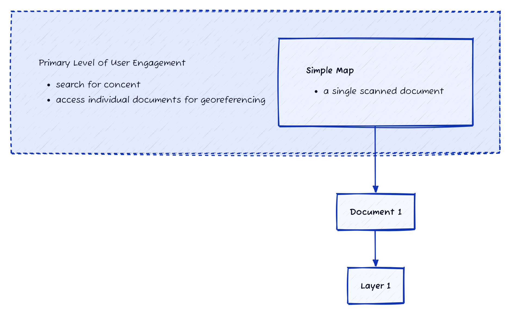
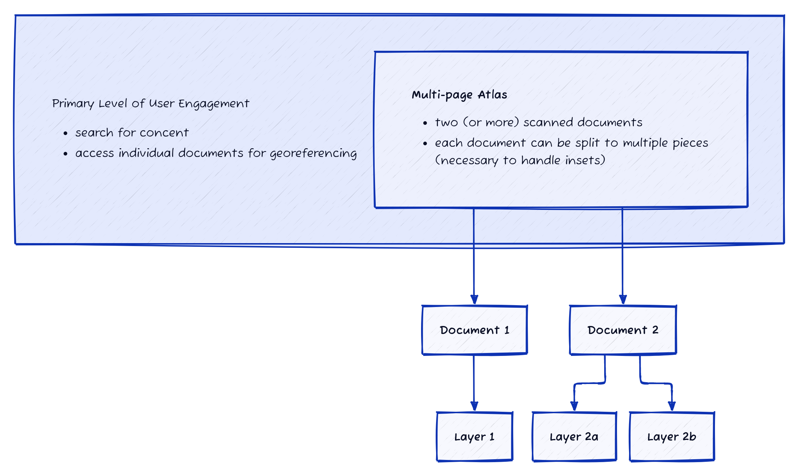
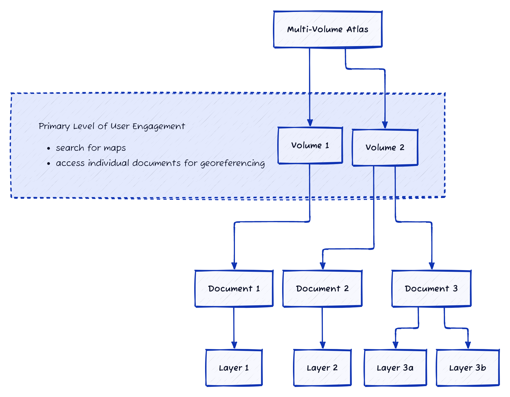
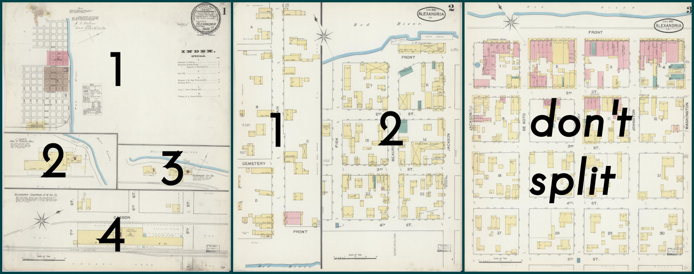

# Concepts

## Handle Complex Content

The data model and hierarchy developed in OHMG is very flexible, allowing for robust handling of single-page maps, multi-page atlases, or even multi-volume altases. This is carried-out by "demoting" (as it were) individual pages or documents and instead focusing one level up on the "Map" level, where a Map can hold one or more documents, each to be georeferenced individually. To illustrate...

### Single Map

In the most basic example, the Map has just one descendant document, and that document can be georeferenced to create a layer.

### Multi-page Atlas

In a more complex (but very common) example, a multi-page atlas will have multiple documents, and each one will be georeferenced individually. These documents are still being accessed through the context of the atlas, providing an easy way to measure and track the completeness of the atlas's georeferencing process.

In this example, you'll notice one of the documents has been split to create two separate layers. More on this [below](#splitting-insets).

### Multi-volume Atlas

:::caution
This level of aggregation is still in development!
:::

Finally, a light-weight grouping mechanism will allow for multiple volumes from the same atlas to be handled together.

### Splitting Insets

Because it is common for historical maps to have insets, or just multiple maps on a single page, the first step in the georeferencing workflow is to define these regions. Then, each region will be georeferenced individually, creating a layer from each piece.

## Seamless Mosaics

Margins are removed from adjacent map layers by creating a "multimask" across the entire item, rather than trimming each layer independently.

## Collaborative Model

An iterative, componentized workflow provides direct access for any user to contribute at any stage in the overall process.

## Transformations & Projections

Because GDAL is used in OHMG behind the scenes, any standard transformation algorithms can be used for GCPs (polynomial, thin plate spline, etc.), and any projection can be targeted.

## Web Services

Layers are immediately published as web services and can easily be integrated into third-party platforms, like OpenHistoricalMap and Felt. 

## Data API

A simple API can provide researchers with programmatic access to GCPs, cutlines, and GeoTIFF download links.
